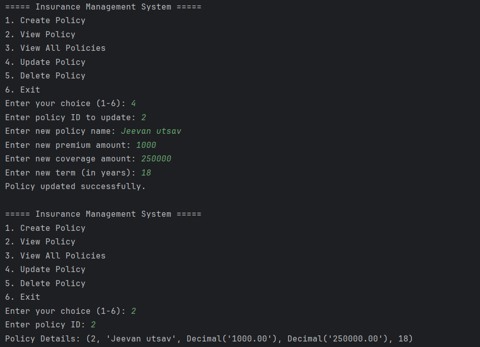

# <p align='center'> Insurance Management System - Coding Challenge </p>
### Name: Saravana Kumar S
Superset ID: 5371342<br>
College: Saveetha Engineering college

## SQL schema design:
- Users Table:
    - userId: A unique number for each user (used as the primary key).

    - username: The name the user uses to log in (text).

    - password: The user's password for authentication (text).

    - role: The role of the user(text).

- Clients Table:
    - clientId: A unique number for each client (used as the primary key).

    - clientName: The name of the client (text).

    - contactInfo: The contact details of the client(text).

    - policyId: The ID of the policy associated with the client.
- Policies Table:
    - policyId: A unique number for each policy (used as the primary key).

    - policyName: The name of the policy, like "Health Shield Basic" (text).

    - premiumAmount: The cost of the policy that needs to be paid periodically (number).

    - coverageAmount: The maximum amount the policy will cover (number).

    - termYears: The duration of the policy in years (number).

- Claims Table:
    - claimId: A unique number for each claim (used as the primary key).

    - claimNumber: A unique number to identify the claim (text).

    - dateFiled: The date when the claim was submitted (date).

    - claimAmount: The amount of money being claimed.

    - status: The current status of the claim.

    - policyId: The ID of the policy related to the claim.

    - clientId: The ID of the client making the claim.

- Payments Table:
    - paymentId: A unique number for each payment (used as the primary key).

    - paymentDate: The date when the payment was made (date).

    - paymentAmount: The amount of money paid.

    - clientId: The ID of the client who made the payment.

### Table and database creation:
```sql
CREATE DATABASE insurance;
USE insurance;

CREATE TABLE Users (
    userId INT PRIMARY KEY AUTO_INCREMENT,
    username VARCHAR(100) NOT NULL,
    password VARCHAR(100) NOT NULL,
    role VARCHAR(100)
);

CREATE TABLE Clients (
    clientId INT PRIMARY KEY AUTO_INCREMENT,
    clientName VARCHAR(100) NOT NULL,
    contactInfo VARCHAR(200),
    policyId INT
);

CREATE TABLE Policies (
    policyId INT PRIMARY KEY AUTO_INCREMENT,
    policyName VARCHAR(100) NOT NULL,
    premiumAmount DECIMAL,
    coverageAmount DECIMAL,
    termYears INT
);

CREATE TABLE Claims (
    claimId INT PRIMARY KEY AUTO_INCREMENT,
    claimNumber VARCHAR(100),
    dateFiled DATE,
    claimAmount DECIMAL,
    status VARCHAR(100),
    policyId INT,
    clientId INT,
    FOREIGN KEY (policyId) REFERENCES Policies(policyId),
    FOREIGN KEY (clientId) REFERENCES Clients(clientId)
);

CREATE TABLE Payments (
    paymentId INT PRIMARY KEY AUTO_INCREMENT,
    paymentDate DATE,
    paymentAmount DECIMAL,
    clientId INT,
    FOREIGN KEY (clientId) REFERENCES Clients(clientId)
);
```
### ER Diagram:


## Entity:
### claim.py:
```py
class Claim:
    def __init__(self, claimId=0, claimNumber="", dateFiled=None, claimAmount=0.0, status="", policyId=0, clientId=0):
        self.claimId = claimId
        self.claimNumber = claimNumber
        self.dateFiled = dateFiled
        self.claimAmount = claimAmount
        self.status = status
        self.policyId = policyId
        self.clientId = clientId

    def __str__(self):
        return (f"Claim [ID: {self.claimId}, Number: {self.claimNumber}, Date: {self.dateFiled}, Amount: {self.claimAmount}, "f"Status: {self.status}, Policy ID: {self.policyId}, Client ID: {self.clientId}]")
```
### client.py:
```py
class Client:
    def __init__(self, clientId=0, clientName="", contactInfo="", policyId=0):
        self.clientId = clientId
        self.clientName = clientName
        self.contactInfo = contactInfo
        self.policyId = policyId

    def __str__(self):
        return f"Client [ID: {self.clientId}, Name: {self.clientName}, Contact: {self.contactInfo}, Policy ID: {self.policyId}]"
```
### payment.py:
```py
class Payment:
    def __init__(self, paymentId=0, paymentDate=None, paymentAmount=0.0, clientId=0):
        self.paymentId = paymentId
        self.paymentDate = paymentDate
        self.paymentAmount = paymentAmount
        self.clientId = clientId

    def __str__(self):
        return (f"Payment [ID: {self.paymentId}, Date: {self.paymentDate}, Amount: {self.paymentAmount}, "f"Client ID: {self.clientId}]")

```

### policy.py:
```py
class Policy:
    def __init__(self, policyId=0, policyName="", premiumAmount=0.0, coverageAmount=0.0, termYears=0):
        self.policyId = policyId
        self.policyName = policyName
        self.premiumAmount = premiumAmount
        self.coverageAmount = coverageAmount
        self.termYears = termYears

    def __str__(self):
        return (f"Policy [ID: {self.policyId}, Name: {self.policyName}, Premium: {self.premiumAmount}, "f"Coverage: {self.coverageAmount}, Term: {self.termYears} years]")

```

### user.py:
```py
class User:
    def __init__(self, userId=0, username="", password="", role=""):
        self.userId = userId
        self.username = username
        self.password = password
        self.role = role

    def __str__(self):
        return f"User [ID: {self.userId}, Username: {self.username}, Role: {self.role}]"

```

## Data Access Object(Dao)
### IPolicyService.py:
```py
from abc import ABC, abstractmethod

class IPolicyService(ABC):
    @abstractmethod
    def createPolicy(self, policy):
        pass

    @abstractmethod
    def getPolicy(self, policyId):
        pass

    @abstractmethod
    def getAllPolicies(self):
        pass

    @abstractmethod
    def updatePolicy(self, policy):
        pass

    @abstractmethod
    def deletePolicy(self, policyId):
        pass
```

### InsuranceServiceImpl.py:
```py
from util.db_connection import get_connection
from util.dbproperty import get_connection_props
from exception.exceptions import PolicyNotFoundException

class InsuranceServiceImpl:
    def __init__(self):
        try:
            props = get_connection_props("util/db.properties")
            self.conn = get_connection(props)
            self.cursor = self.conn.cursor()
        except Exception as e:
            raise Exception(f"Error initializing database connection: {e}")

    def createPolicy(self, policy):
        try:
            query = "INSERT INTO Policies (policyName, premiumAmount, coverageAmount, termYears) VALUES (%s, %s, %s, %s)"
            values = (policy.policyName, policy.premiumAmount, policy.coverageAmount, policy.termYears)
            self.cursor.execute(query, values)
            self.conn.commit()
        except Exception as e:
            self.conn.rollback()
            raise Exception(f"Error adding policy: {e}")

    def getPolicy(self, policyId):
        try:
            query = "SELECT * FROM Policies WHERE policyId = %s"
            self.cursor.execute(query, (policyId,))
            result = self.cursor.fetchone()
            if not result:
                raise PolicyNotFoundException(f"Policy with ID {policyId} not found.")
            return result
        except Exception as e:
            raise Exception(f"Error fetching policy: {e}")

    def getAllPolicies(self):
        try:
            query = "SELECT * FROM Policies"
            self.cursor.execute(query)
            results = self.cursor.fetchall()
            return results
        except Exception as e:
            raise Exception(f"Error fetching all policies: {e}")

    def updatePolicy(self, policy):
        try:
            query = "UPDATE Policies SET policyName = %s, premiumAmount = %s, coverageAmount = %s, termYears = %s WHERE policyId = %s"
            values = (policy.policyName, policy.premiumAmount, policy.coverageAmount, policy.termYears, policy.policyId)
            self.cursor.execute(query, values)
            if self.cursor.rowcount == 0:
                raise PolicyNotFoundException(f"Policy with ID {policy.policyId} not found.")
            self.conn.commit()
        except Exception as e:
            self.conn.rollback()
            raise Exception(f"Error updating policy: {e}")

    def deletePolicy(self, policyId):
        try:
            query = "DELETE FROM Policies WHERE policyId = %s"
            self.cursor.execute(query, (policyId,))
            if self.cursor.rowcount == 0:
                raise PolicyNotFoundException(f"Policy with ID {policyId} not found.")
            self.conn.commit()
        except Exception as e:
            self.conn.rollback()
            raise Exception(f"Error deleting policy: {e}")

    def __del__(self):
        try:
            if hasattr(self, 'cursor') and self.cursor:
                self.cursor.close()
            if hasattr(self, 'conn') and self.conn:
                self.conn.close()
        except Exception as e:
            pass
```

## Exceptions:
```py
class PolicyNotFoundException(Exception):
    def __init__(self, message="Policy not found."):
        super().__init__(message)


class DatabaseConnectionException(Exception):
    def __init__(self, message="Error connecting to the database."):
        super().__init__(message)


class InvalidInputException(Exception):
    def __init__(self, message="Invalid input provided."):
        super().__init__(message)
```

## Main.py:
```py
from dao.InsuranceServiceImpl import InsuranceServiceImpl
from entity.Policy import Policy
from exception.exceptions import PolicyNotFoundException, InvalidInputException


def display_menu():
    print("\n===== Insurance Management System =====")
    print("1. Create Policy")
    print("2. View Policy")
    print("3. View All Policies")
    print("4. Update Policy")
    print("5. Delete Policy")
    print("6. Exit")


def main():
    service = InsuranceServiceImpl()

    while True:
        display_menu()
        choice = input("Enter your choice (1-6): ")

        if choice == '1':
            try:
                policyName = input("Enter policy name: ")
                premiumAmount = float(input("Enter premium amount: "))
                coverageAmount = float(input("Enter coverage amount: "))
                termYears = int(input("Enter term (in years): "))
                policy = Policy(policyName=policyName, premiumAmount=premiumAmount, coverageAmount=coverageAmount, termYears=termYears)
                service.createPolicy(policy)
                print("Policy created successfully.")
            except ValueError:
                print("Error: Please enter valid numeric values for premium, coverage, and term.")
            except Exception as e:
                print(f"Error: {e}")

        elif choice == '2':
            try:
                policyId = int(input("Enter policy ID: "))
                policy = service.getPolicy(policyId)
                print(f"Policy Details: {policy}")
            except PolicyNotFoundException as e:
                print(f"Error: {e}")
            except ValueError:
                print("Error: Please enter a valid numeric policy ID.")
            except Exception as e:
                print(f"Error: {e}")

        elif choice == '3':
            try:
                policies = service.getAllPolicies()
                print("\n===== All Policies =====")
                for policy in policies:
                    print(f"ID: {policy[0]}, Name: {policy[1]}, Premium: {policy[2]}, Coverage: {policy[3]}, Term: {policy[4]} years")
            except Exception as e:
                print(f"Error: {e}")

        elif choice == '4':
            try:
                policyId = int(input("Enter policy ID to update: "))
                policyName = input("Enter new policy name: ")
                premiumAmount = float(input("Enter new premium amount: "))
                coverageAmount = float(input("Enter new coverage amount: "))
                termYears = int(input("Enter new term (in years): "))
                policy = Policy(policyId=policyId, policyName=policyName, premiumAmount=premiumAmount, coverageAmount=coverageAmount, termYears=termYears)
                service.updatePolicy(policy)
                print("Policy updated successfully.")
            except PolicyNotFoundException as e:
                print(f"Error: {e}")
            except ValueError:
                print("Error: Please enter valid numeric values for premium, coverage, and term.")
            except Exception as e:
                print(f"Error: {e}")

        elif choice == '5':
            try:
                policyId = int(input("Enter policy ID to delete: "))
                service.deletePolicy(policyId)
                print("Policy deleted successfully.")
            except PolicyNotFoundException as e:
                print(f"Error: {e}")
            except ValueError:
                print("Error: Please enter a valid numeric policy ID.")
            except Exception as e:
                print(f"Error: {e}")

        elif choice == '6':
            print("Exiting the application. Goodbye!")
            break

        else:
            print("Invalid choice. Please try again.")
main()
```
## Results:
### 1. Create Policy:


### 2. View Policy:


### 3. View All Policies:


### 4. Update Policy:



### 5. Delete Policy:


